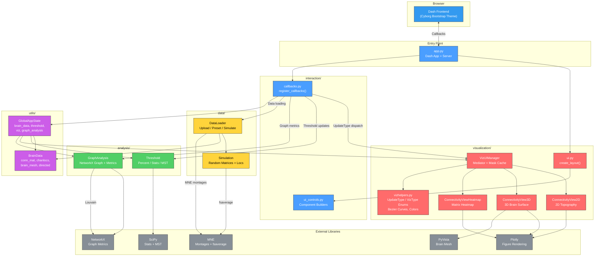
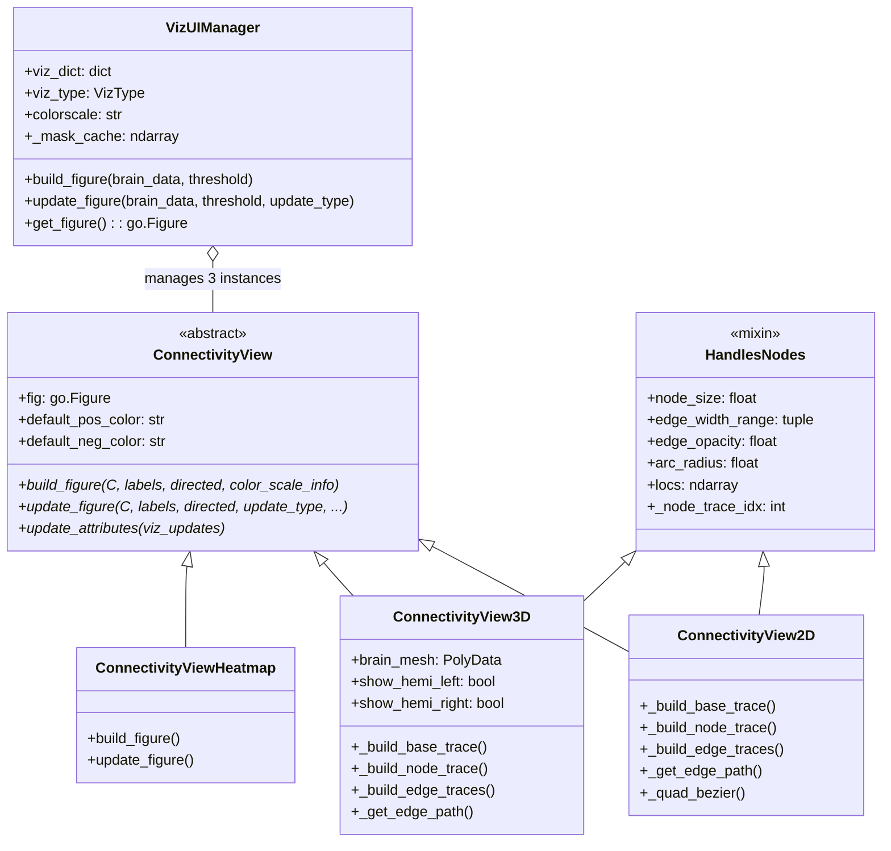
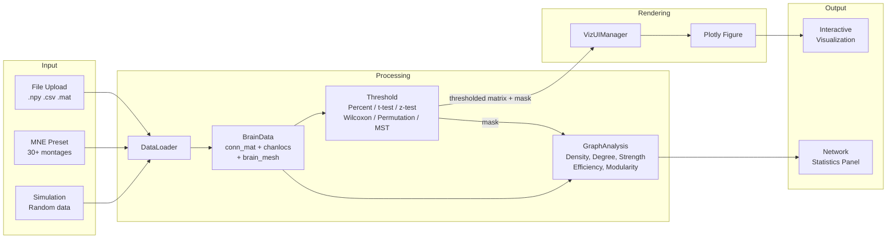
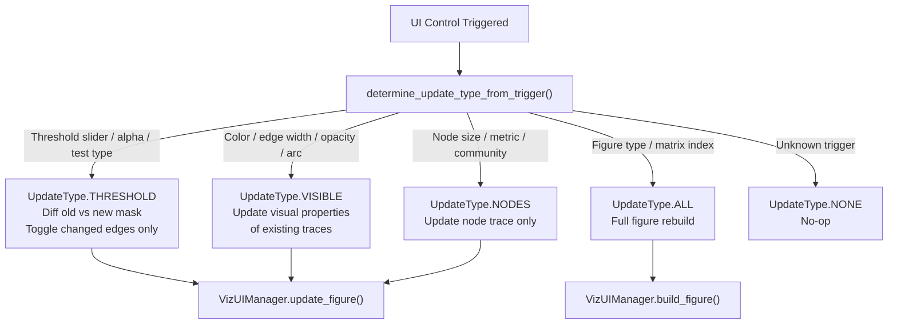

# Architecture Diagram

## System Overview

```mermaid
graph TB
    subgraph Browser["Browser"]
        UI["Dash Frontend<br/>(Cyborg Bootstrap Theme)"]
    end

    subgraph Entry["Entry Point"]
        APP["app.py<br/>Dash App + Server"]
    end

    subgraph Interaction["interaction/"]
        CB["callbacks.py<br/>register_callbacks()"]
        UIC["ui_controls.py<br/>Component Builders"]
    end

    subgraph Visualization["visualization/"]
        UILAY["ui.py<br/>create_layout()"]
        VUM["VizUIManager<br/>Mediator + Mask Cache"]
        CV2D["ConnectivityView2D<br/>2D Topography"]
        CV3D["ConnectivityView3D<br/>3D Brain Surface"]
        CVHM["ConnectivityViewHeatmap<br/>Matrix Heatmap"]
        VH["vizhelpers.py<br/>UpdateType / VizType Enums<br/>Bezier Curves, Colors"]
    end

    subgraph Analysis["analysis/"]
        TH["Threshold<br/>Percent / Stats / MST"]
        GA["GraphAnalysis<br/>NetworkX Graph + Metrics"]
    end

    subgraph Data["data/"]
        DL["DataLoader<br/>Upload / Preset / Simulate"]
        SIM["Simulation<br/>Random Matrices + Locs"]
    end

    subgraph Utils["utils/"]
        BD["BrainData<br/>conn_mat, chanlocs,<br/>brain_mesh, directed"]
        GAS["GlobalAppState<br/>brain_data, threshold,<br/>viz, graph_analysis"]
    end

    subgraph External["External Libraries"]
        MNE["MNE<br/>Montages + fsaverage"]
        NX["NetworkX<br/>Graph Metrics"]
        SP["SciPy<br/>Stats + MST"]
        PV["PyVista<br/>Brain Mesh"]
        PL["Plotly<br/>Figure Rendering"]
    end

    %% Main flow
    APP --> UILAY
    APP --> CB
    UI <-->|Callbacks| APP

    %% Callback dispatch
    CB -->|UpdateType dispatch| VUM
    CB -->|Threshold updates| TH
    CB -->|Graph metrics| GA
    CB -->|Data loading| DL

    %% Layout
    UILAY --> UIC

    %% VizUIManager delegates to visualizers
    VUM --> CV2D
    VUM --> CV3D
    VUM --> CVHM
    VUM --> VH

    %% Data flow
    DL --> SIM
    DL --> BD
    DL -->|MNE montages| MNE

    %% Analysis dependencies
    TH --> SP
    GA --> NX
    GA -->|Louvain| NX

    %% State
    GAS --> BD
    GAS --> TH
    GAS --> VUM
    GAS --> GA
    CB --> GAS

    %% Rendering
    CV2D --> PL
    CV3D --> PL
    CV3D --> PV
    CVHM --> PL
    SIM -->|fsaverage| MNE

    %% Styling
    classDef entry fill:#4a9eff,stroke:#333,color:#fff
    classDef viz fill:#ff6b6b,stroke:#333,color:#fff
    classDef analysis fill:#51cf66,stroke:#333,color:#fff
    classDef data fill:#ffd43b,stroke:#333,color:#000
    classDef utils fill:#cc5de8,stroke:#333,color:#fff
    classDef external fill:#868e96,stroke:#333,color:#fff
    classDef browser fill:#339af0,stroke:#333,color:#fff

    class APP entry
    class UILAY,VUM,CV2D,CV3D,CVHM,VH viz
    class CB,UIC entry
    class TH,GA analysis
    class DL,SIM data
    class BD,GAS utils
    class MNE,NX,SP,PV,PL external
    class UI browser
```

## Class Hierarchy

```mermaid
classDiagram
    class ConnectivityView {
        <<abstract>>
        +fig: go.Figure
        +default_pos_color: str
        +default_neg_color: str
        +build_figure(C, labels, directed, color_scale_info)*
        +update_figure(C, labels, directed, update_type, ...)*
        +update_attributes(viz_updates)*
    }

    class HandlesNodes {
        <<mixin>>
        +node_size: float
        +edge_width_range: tuple
        +edge_opacity: float
        +arc_radius: float
        +locs: ndarray
        +_node_trace_idx: int
    }

    class ConnectivityView2D {
        +_build_base_trace()
        +_build_node_trace()
        +_build_edge_traces()
        +_get_edge_path()
        +_quad_bezier()
    }

    class ConnectivityView3D {
        +brain_mesh: PolyData
        +show_hemi_left: bool
        +show_hemi_right: bool
        +_build_base_trace()
        +_build_node_trace()
        +_build_edge_traces()
        +_get_edge_path()
    }

    class ConnectivityViewHeatmap {
        +build_figure()
        +update_figure()
    }

    class VizUIManager {
        +viz_dict: dict
        +viz_type: VizType
        +colorscale: str
        +_mask_cache: ndarray
        +build_figure(brain_data, threshold)
        +update_figure(brain_data, threshold, update_type)
        +get_figure(): go.Figure
    }

    ConnectivityView <|-- ConnectivityView2D
    ConnectivityView <|-- ConnectivityView3D
    ConnectivityView <|-- ConnectivityViewHeatmap
    HandlesNodes <|-- ConnectivityView2D
    HandlesNodes <|-- ConnectivityView3D
    VizUIManager o-- ConnectivityView : manages 3 instances
```

## Data Flow

```mermaid
flowchart LR
    subgraph Input
        UP[File Upload<br/>.npy .csv .mat]
        PR[MNE Preset<br/>30+ montages]
        SM[Simulation<br/>Random data]
    end

    subgraph Processing
        DL[DataLoader]
        BD[BrainData<br/>conn_mat + chanlocs<br/>+ brain_mesh]
        TH[Threshold<br/>Percent / t-test / z-test<br/>Wilcoxon / Permutation / MST]
        GA[GraphAnalysis<br/>Density, Degree, Strength<br/>Efficiency, Modularity]
    end

    subgraph Rendering
        VUM[VizUIManager]
        FIG[Plotly Figure]
    end

    subgraph Output
        VIZ["Interactive<br/>Visualization"]
        STATS["Network<br/>Statistics Panel"]
    end

    UP --> DL
    PR --> DL
    SM --> DL
    DL --> BD
    BD --> TH
    TH -->|thresholded matrix + mask| VUM
    TH -->|mask| GA
    BD --> GA
    VUM --> FIG
    FIG --> VIZ
    GA --> STATS
```

## Update Dispatch

```mermaid
flowchart TD
    TRIGGER["UI Control Triggered"]
    CLASSIFY["determine_update_type_from_trigger()"]

    TRIGGER --> CLASSIFY

    CLASSIFY -->|Threshold slider / alpha / test type| UT_THRESH["UpdateType.THRESHOLD<br/>Diff old vs new mask<br/>Toggle changed edges only"]
    CLASSIFY -->|Color / edge width / opacity / arc| UT_VIS["UpdateType.VISIBLE<br/>Update visual properties<br/>of existing traces"]
    CLASSIFY -->|Node size / metric / community| UT_NODE["UpdateType.NODES<br/>Update node trace only"]
    CLASSIFY -->|Figure type / matrix index| UT_ALL["UpdateType.ALL<br/>Full figure rebuild"]
    CLASSIFY -->|Unknown trigger| UT_NONE["UpdateType.NONE<br/>No-op"]

    UT_THRESH --> VUM["VizUIManager.update_figure()"]
    UT_VIS --> VUM
    UT_NODE --> VUM
    UT_ALL --> VUM2["VizUIManager.build_figure()"]
```
